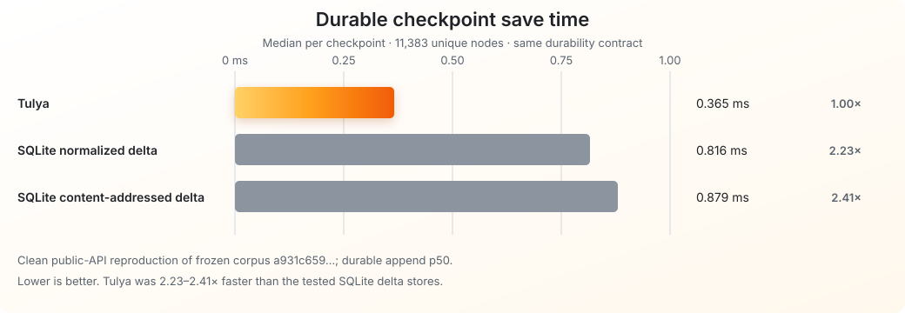
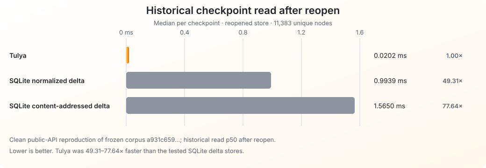
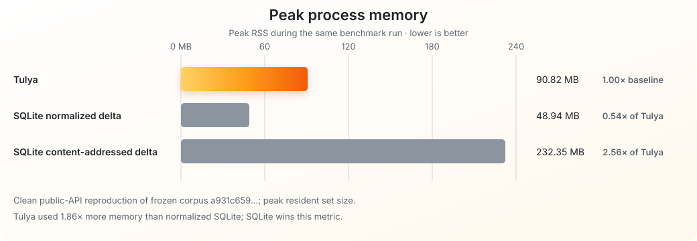
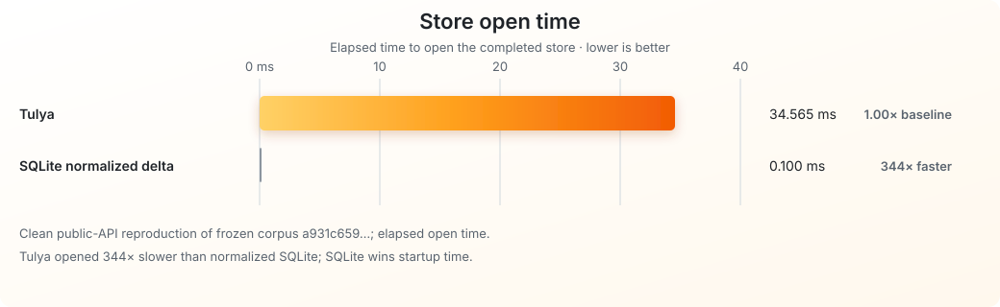

# Tulya

**An embedded versioning engine for large application state.**

**SQLite manages relational records. Tulya manages versioned application state.**

Many applications repeatedly save a large state even though each new version
changes only a small part. They need to keep old versions, branch from them,
and read them again after restart.

Tulya is built for that shape:

~~~text
500 MB project
40 KB edit
50,000 retained versions
frequent forks from old versions
~~~

Each version points to a shared data tree. Unchanged parts stay shared, old
versions remain readable, and an edit creates a new version.

~~~text
              V0
           /  |  \
         V1  V2  V3
                   \
                   V4

      unchanged content is shared
      each edit creates a new version
~~~

Keep users, permissions, metadata, indexes, and search in SQLite. Keep the
versioned application state, branches, and historical reads in Tulya. They can
live in the same embedded application.

> [!WARNING]
> **Under active development.** <code>tulya-core</code> currently provides
> generic persistent versions, branching, local range edits, expiration, GC,
> and exact historical reads. The measured public workload is an append-only
> agent/message-history adapter. Higher-level adapters for CAD, media, and
> other structured state are not shipped yet. The API and first public disk
> format are not frozen. Scope is embedded and single-writer; do not use Tulya
> as the only copy of important production data.

## Benchmarks so far

**On a pinned public OpenHands workload: 2.2–2.4× faster durable saves,
49–78× faster historical reads, and 6.75–6.96× less storage than the two
tested SQLite delta stores.**

**11,383 checkpoints · 91 OpenHands attempts · 8 software tasks**

Each new message created one checkpoint. Every tested backend reconstructed
every checkpoint exactly before and after reopen. These measurements are from
the **earlier checkpoint implementation**, not the new AVL core.

**Lower is better in every row. Bold marks the lowest recorded value.** The
same two custom SQLite history stores are compared throughout.

| Measurement | Tulya | SQLite normalized delta | SQLite content-addressed delta |
| --- | ---: | ---: | ---: |
| Save a checkpoint — median (ms) | **0.365** | 0.816 | 0.879 |
| Read a historical checkpoint after reopen — median (ms) | **0.0202** | 0.9939 | 1.5650 |
| Storage after reopen — marginal allocated (MB) | **5.49** | 38.24 | 37.10 |
| Peak process memory — RSS (MB) | 90.82 | **48.94** | 232.35 |
| Open the store — elapsed (ms) | 34.565 | **0.100** | — |

### Storage

### Durable save time

### Historical read time

### Peak memory — SQLite wins this metric

### Store startup — SQLite wins this metric

The benchmark shows clear wins on save speed, historical reads, and retained
storage. It also shows real tradeoffs: Tulya used **1.86× more peak memory**
than normalized SQLite and opened the store **344× slower**. SQLite wins those
two metrics in this run.

Saves include the benchmark's per-checkpoint durability step. Historical reads
measure checkpoint reconstruction after opening the store; they are not
store-open timings or controlled-cold disk reads. MB means 1,000,000 bytes;
marginal storage excludes the empty-store baseline. “—” means the portable
evidence record has no value for that cell, not zero.

Run <code>TULYA-BF-OH-CLEAN-C59BD4B</code> (2026-08-24) is a clean, same-machine
public API reproduction of a frozen [OpenHands dataset
subset](https://huggingface.co/datasets/nebius/SWE-rebench-openhands-trajectories/commit/35455389ab51bf5e2306bfd436ef72d0f98bf882).
The results do not establish performance for media, arbitrary blobs, or local
edits to large durable states. They are not an independent holdout result.

[Exact measurements](benchmarks/evidence/clean_public_api_reproduction.json)
· [Methodology, corpus hashes, and limitations](docs/BENCHMARKS.md)
· [Reproduce the benchmark](benchmarks/branch_forest/README.md)

## Why build a new storage kernel?

SQLite is a relational database. It is excellent for records, transactions,
indexes, and queries. Tulya is a persistent-history engine. They solve
different problems and can be used together.

| SQLite | Tulya |
| --- | --- |
| Users, permissions, metadata | Large versioned application state |
| Tables, indexes, and search | Historical reads and branches |
| Current records and relationships | Local edits that preserve old versions |

SQLite can store application history, but the application must design and
maintain the history layer: snapshots, change records, parent links, replay,
retention, and reclamation. Tulya makes versions, branches, and their shared
storage model native operations.

The design is domain-neutral. The core stores persistent sequences and their
history; adapters translate edits from a data family into sequence operations.
The current measured adapter handles append-only message history. Future
adapters may cover documents, CAD, simulations, robotics state, media, and
other structured artifacts where a local edit can be represented locally.

## How the architecture works

The new core uses a **persistent AVL sequence tree**. “Persistent” means an
edit preserves the old tree. “AVL” means the tree remains height-balanced.

- **Version:** a root identifies a sequence of data.
- **Branch:** a new version can reuse the same root without copying its content.
- **Edit:** insert, delete, or replace a range by creating affected payload and
  tree nodes while sharing untouched subtrees.
- **Read:** follow the selected root to the requested content. Subtree lengths
  guide range navigation.
- **Retention:** expire versions, then reclaim nodes no retained version needs.

AVL trees are established data structures. Tulya’s engineering work combines
persistent sequence edits with durable version identity, publication, recovery,
and reclamation in one embedded kernel.

~~~mermaid
flowchart LR
    App["Application"]

    subgraph Families["Data families"]
        Messages["Agent / message history"]
        Text["Text / UTF-8"]
        Future["Future adapters documents · CAD · media · simulations"]
    end

    subgraph Storage["Embedded storage"]
        SQLite["SQLite relational records · indexes · search"]
        Adapters["Tulya adapters translate local edits"]
        Core["One domain-neutral Tulya kernel versions · branches · retention"]
        Tree["Persistent AVL sequence shared subtrees · range edits"]
        Durable["WAL · snapshots · recovery GC · compaction"]
    end

    App --> SQLite
    App --> Messages
    App --> Text
    App -.-> Future
    Messages --> Adapters
    Text -.-> Adapters
    Future -.-> Adapters
    Adapters --> Core
    Core --> Tree
    Tree --> Durable

    classDef current fill:#fff0c2,stroke:#d97706,color:#1f2328;
    classDef future fill:#f3f4f6,stroke:#9ca3af,color:#4b5563,stroke-dasharray:5 5;
    class Messages,Text current;
    class Future future;
~~~

This is the target core/adapter architecture. The existing checkpoint and
LangGraph evaluation path uses the earlier implementation; its benchmark
numbers are not measurements of every layer shown here.

Adapters must preserve local edits. A small visible change does not always
produce a small byte change: re-encoding a compressed image can rewrite most
of the file. Tulya does not automatically discover localized differences in
arbitrary blobs. Data boundaries and application semantics belong in adapters.

Technical detail:
[Core architecture and engineering plan](docs/TULYA_CORE_ENGINEERING_PLAN.md)
· [AVL persistence design](docs/PERSISTENT_AVL_IMAGE.md)
· [Rust / Lean correspondence](docs/FORMAL_MODEL_CORRESPONDENCE.md)

## What exists, and what comes first

| Area | Status |
| --- | --- |
| Generic core | Implemented primitives for historical versions, branching, persistent insert/delete/replace, and exact reads. |
| Durability and lifecycle | Single-writer authority, WAL and sealed snapshots, request receipts, expiration, GC, and compaction exist; production qualification remains ongoing. |
| Current measured workload | Checkpoint CLI, local evaluator, and a LangGraph shadow adapter for one append-only message channel. |
| Current engineering work | Incremental physical persistence: carry local tree edits through to local disk I/O. |
| Future adapters | Documents, CAD, simulations, robotics state, images, audio, and other structured artifacts; not implemented product support. |

The core’s structural sharing is implemented. The stronger durable-I/O goal is
still being established: a small edit to a large parent should read and write
the affected paths and boundary data, rather than the whole unchanged parent.
Changed payload, tree nodes, and authority metadata all contribute to the work.

The [engineering plan](docs/TULYA_CORE_ENGINEERING_PLAN.md) tracks that work.
The [next benchmark campaign](docs/TULYA_BENCHMARK_EXECUTION_PLAN.md) will test
large states, local edits, and many branches after the readiness gate.

## Try the current evaluation path

Start with an existing message-history workload: long sessions, retries from
earlier checkpoints, and a need to read saved history exactly.

Follow [Evaluate Tulya on your workload](docs/EVALUATING_TULYA.md) to run the
local evaluator. Mirror checkpoints alongside your existing backend and
compare storage, save/read latency, memory, and recovery.

The [LangGraph shadow adapter](integrations/langgraph/README.md) mirrors one
append-only message channel. It leaves the existing saver authoritative and
does not replace primary reads or pending-write handling.

To discuss a pilot, [open an issue](https://github.com/Vedsaga/tulya-checkpoint-store/issues)
with a non-sensitive description of your data size, edit pattern, version
count, and current history implementation.

## Build and test

~~~bash
git clone https://github.com/Vedsaga/tulya-checkpoint-store.git
cd tulya-checkpoint-store

cargo fmt --all -- --check
cargo clippy --workspace --all-targets --features local-server --locked -- -D warnings
cargo test --workspace --all-targets --features local-server --locked -- --test-threads=1
cargo test --workspace --locked --features fault-injection -- --test-threads=1
cargo package -p tulya-core --locked
~~~

## Formal work

The Lean reference/specification project covers persistent AVL edits,
branching, lifecycle, reclamation, crash-recovery models, and physical
persistence properties. It supplies specifications and conformance references.

**The Rust implementation is not claimed to be formally verified.**

See [Rust / Lean correspondence](docs/FORMAL_MODEL_CORRESPONDENCE.md) for the
relationship between the models and implementation.

## More documentation

- [Core engineering plan](docs/TULYA_CORE_ENGINEERING_PLAN.md)
- [Benchmark methodology and results](docs/BENCHMARKS.md)
- [Benchmark execution plan](docs/TULYA_BENCHMARK_EXECUTION_PLAN.md)
- [Production-readiness invariants](docs/PRODUCTION_READINESS.md)
- [Evaluation guide](docs/EVALUATING_TULYA.md)
- [Security policy](SECURITY.md)
- [Contributing](CONTRIBUTING.md)

## License

MIT.
