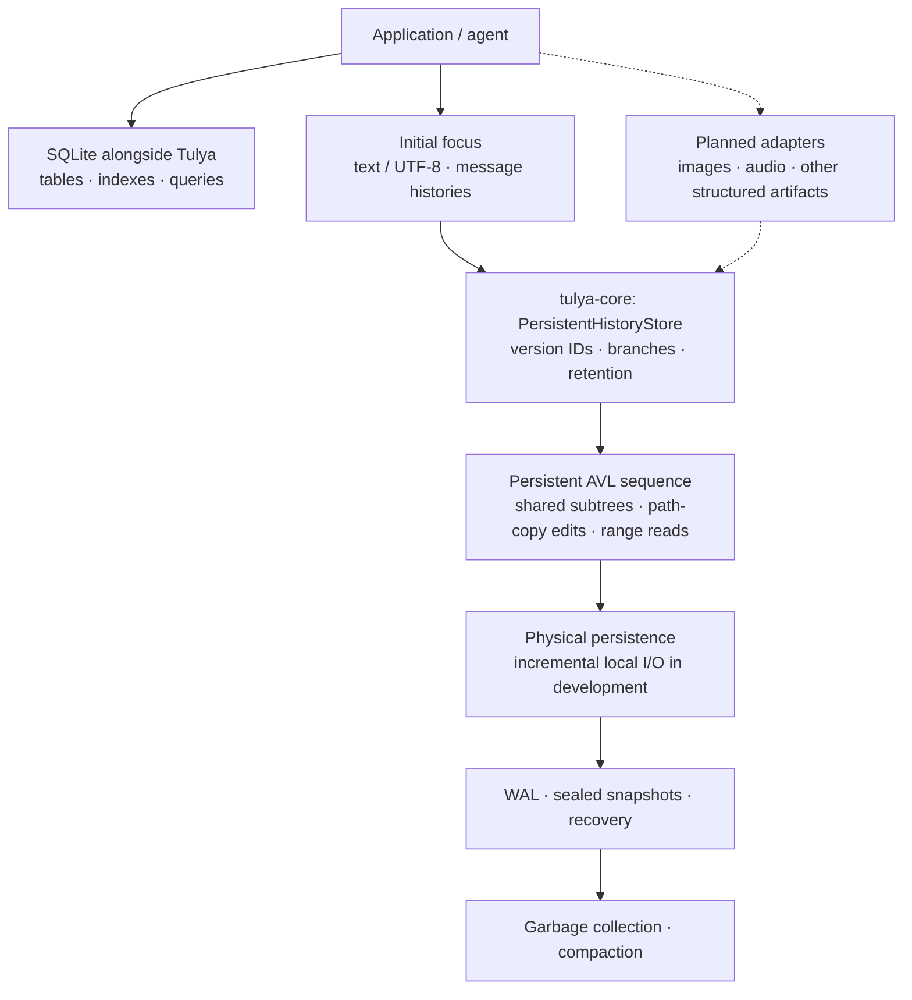

# Tulya

**An embedded versioning kernel, built from scratch for text, media, and any structured data.**

**SQLite manages relational records. Tulya manages versioned application state.**

We’re building one shared storage foundation for data that changes, branches,
and needs a history. Keep searchable records in SQLite; preserve, read, and
branch your application's state in Tulya. They can live in the same application.

Tulya represents versions as roots in a shared data tree. Unchanged parts stay
shared; each version points to its contents. The new core uses a **persistent
AVL sequence tree** to support insertions, deletions, and replacements while
preserving earlier versions.

> [!WARNING]
> **Under active development.** Initial focus: text/UTF-8 and append-only
> message histories. Image, audio, and other domain adapters are planned, not
> shipping features. The API and first public disk format are not frozen.
> Embedded, single-writer scope; do not use Tulya as the only copy of important
> production data.

## Benchmarks so far

**11,383 checkpoints · 91 OpenHands attempts · 8 software tasks**

Each new message creates one checkpoint. All tested backends reconstructed
every checkpoint exactly before and after reopen. These measurements are from
the **earlier checkpoint implementation**, not the new AVL core.

**Lower is better in every row. Bold marks the lowest recorded value.**
The same two custom SQLite history stores are compared throughout.

| Measurement | Tulya | SQLite normalized delta | SQLite content-addressed delta |
| --- | ---: | ---: | ---: |
| Save a checkpoint — median (ms) | **0.365** | 0.816 | 0.879 |
| Read a historical checkpoint after reopen — median (ms) | **0.0202** | 0.9939 | 1.5650 |
| Storage after reopen — marginal allocated (MB) | **5.49** | 38.24 | 37.10 |
| Peak process memory — RSS (MB) | 90.82 | **48.94** | 232.35 |
| Open the store — elapsed (ms) | 34.565 | **0.100** | — |

### Save speed

<p align="center"></p>

### Historical read speed

<p align="center"></p>

### Storage

<p align="center"></p>

### Peak memory — SQLite wins this metric

<p align="center"></p>

### Store startup — SQLite wins this metric

<p align="center"></p>

**Result:** 2.2–2.4× faster saves, 49–78× faster historical reads, and
6.75–6.96× less storage than these SQLite delta stores.

**Tradeoff:** 1.86×
the peak memory and about 344× the store-open time of normalized SQLite. It is still in development.

Saves include the benchmark's per-checkpoint durability step. Historical reads
measure checkpoint reconstruction after opening the store; they are not
store-open timings or controlled-cold disk reads. MB means 1,000,000 bytes;
marginal storage excludes the empty-store baseline. “—” means the portable
evidence record has no value for that cell, not zero.

Run `TULYA-BF-OH-CLEAN-C59BD4B` (2026-08-24) is a clean, same-machine public-API reproduction of a
frozen [OpenHands dataset subset](https://huggingface.co/datasets/nebius/SWE-rebench-openhands-trajectories/commit/35455389ab51bf5e2306bfd436ef72d0f98bf882).
They do not establish performance for media, arbitrary blobs, or local edits
to large durable states. They are not an independent holdout result.

[Exact measurements](benchmarks/evidence/clean_public_api_reproduction.json)
· [Methodology, corpus hashes, and limitations](docs/BENCHMARKS.md)
· [Reproduce the benchmark](benchmarks/branch_forest/README.md)

Other backends and durability qualifications are in the linked full results.
Future README results follow the same [presentation contract](docs/BENCHMARKS.md#presentation-contract).

## Why build a new storage kernel?

Our starting point is the application we want to enable: an AI agent edits a
document, revises an image, adjusts an audio segment, and tries several
alternatives. Each data type has different editing rules, but each needs
versions, branches, historical reads, and recovery.

SQLite can store text, binary data, and application-defined history. It gives
you transactions, tables, and indexes. To keep a branching history, you design
the versioning layer: snapshots, change records, parent links, and
reconstruction.

**Tulya puts that versioning layer inside an embedded storage kernel.** We want
the convenience of an in-process database for a different native operation:
editing and branching retained versions of data. An application can keep its
searchable metadata in SQLite and its versioned content in Tulya.

Building the kernel lets the version representation guide edits, reads,
persistence, and reclamation together. Our architectural choice is to share
unchanged subtrees between versions and read a version through its own root,
instead of reconstructing it by replaying its ancestors’ edit records.
Returning a complete version still requires reading its contents.

The ambition is **one versioning core, with adapters for different data
families**. An adapter understands paragraphs, records, image regions, or
audio segments; the core understands sequences, edits, versions, and branches.

## How the architecture works

The new core uses a **persistent AVL sequence tree**. “Persistent” means an
edit preserves the old tree; “AVL” means the tree remains height-balanced.

- **Version:** a root identifies a sequence of data.
- **Branch:** a new version can reuse the same root without copying its content.
- **Edit:** insert, delete, or replace a range by creating affected payload and
  tree nodes, while sharing untouched subtrees.
- **Read:** follow the selected root to the requested content. Subtree lengths
  guide range navigation.
- **Retention:** expire versions, then reclaim nodes no retained version needs.

AVL trees are established data structures. Tulya’s engineering work combines
persistent sequence edits with durable version identity, publication,
recovery, and reclamation in one kernel.



This is the target core/adapter architecture. The existing checkpoint and
LangGraph evaluation path uses the earlier implementation; its benchmark
numbers are not measurements of every layer shown here.

**Adapters must preserve local edits.** A small visible change does not always
produce a small byte change: re-encoding a compressed image can rewrite most
of the file. Tulya does not automatically discover localized differences in
arbitrary blobs. UTF-8 boundaries, media formats, and application semantics
belong in adapters.

Technical detail:
[Core architecture and engineering plan](docs/TULYA_CORE_ENGINEERING_PLAN.md)
· [AVL persistence design](docs/PERSISTENT_AVL_IMAGE.md)
· [Rust / Lean correspondence](docs/FORMAL_MODEL_CORRESPONDENCE.md)

## What exists, and what comes first

| Area | Status |
| --- | --- |
| Generic core | Implemented primitives for historical versions, branching, persistent insert/delete/replace, and exact reads. |
| Durability and lifecycle | Single-writer authority, WAL and sealed snapshots, request receipts, expiration, GC, and compaction exist; production qualification remains ongoing. |
| Initial data focus | Text/UTF-8 and message histories. The sequence core works on bytes; text-aware boundaries and higher-level meaning belong to callers/adapters. |
| Evaluation today | Checkpoint CLI, local evaluator, and a LangGraph shadow adapter for one append-only message channel. |
| Current engineering work | Incremental physical persistence: carry local tree edits through to local disk I/O. |
| Future adapters | Image, audio, and other structured artifacts; not implemented product support. |

The core’s structural sharing is implemented. The stronger durable-I/O goal is
still being established: a small edit to a large parent should read and write
the affected paths and boundary data, rather than the whole unchanged parent.
Changed payload, tree nodes, and authority metadata all contribute to the work.

The [engineering plan](docs/TULYA_CORE_ENGINEERING_PLAN.md) tracks that work.
The [next benchmark campaign](docs/TULYA_BENCHMARK_EXECUTION_PLAN.md) will test
large states, local edits, and many branches after the readiness gate.

## Try the current evaluation path

Start with an existing message-history workload: long sessions, retries from
earlier checkpoints, and a need to read saved history exactly.

Follow [Evaluate Tulya on your workload](docs/EVALUATING_TULYA.md) to run the
local evaluator. Mirror checkpoints alongside your existing backend and
compare storage, save/read latency, memory, and recovery.

The [LangGraph shadow adapter](integrations/langgraph/README.md) mirrors one
append-only message channel. It leaves the existing saver authoritative and
does not replace primary reads or pending-write handling.

To discuss a pilot, [open an issue](https://github.com/Vedsaga/tulya-checkpoint-store/issues)
with a non-sensitive description of your data size, edit pattern, version
count, and current history implementation.

## Build and test

```bash
git clone https://github.com/Vedsaga/tulya-checkpoint-store.git
cd tulya-checkpoint-store

cargo fmt --all -- --check
cargo clippy --workspace --all-targets --features local-server --locked -- -D warnings
cargo test --workspace --all-targets --features local-server --locked -- --test-threads=1
cargo test --workspace --locked --features fault-injection -- --test-threads=1
cargo package -p tulya-core --locked
```

## Formal work

The Lean reference/specification project covers persistent AVL edits,
branching, lifecycle, reclamation, crash-recovery models, and physical
persistence properties. It supplies specifications and conformance references.

**The Rust implementation is not claimed to be formally verified.**

See [Rust / Lean correspondence](docs/FORMAL_MODEL_CORRESPONDENCE.md) for the
relationship between the models and implementation.

## More documentation

- [Core engineering plan](docs/TULYA_CORE_ENGINEERING_PLAN.md)
- [Benchmark methodology and results](docs/BENCHMARKS.md)
- [Benchmark execution plan](docs/TULYA_BENCHMARK_EXECUTION_PLAN.md)
- [Production-readiness invariants](docs/PRODUCTION_READINESS.md)
- [Evaluation guide](docs/EVALUATING_TULYA.md)
- [Security policy](SECURITY.md)
- [Contributing](CONTRIBUTING.md)

## License

MIT.
