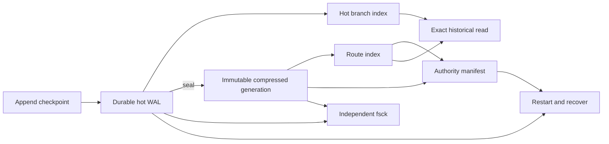

# Tulya Checkpoint Store

**Store a growing history without saving the whole history again at every
checkpoint.**

> **Status: alpha.** Tulya is embedded and single-writer. Try it beside your
> existing database first. Do not make it your only copy of production data
> yet.

## Why does this exist?

Imagine an agent already has 100 messages in its history.

It takes one more step, so now it has 101 messages. If we save a full snapshot,
we write the first 100 messages again just to preserve one new message. At the
next checkpoint we write the same history again.

Tulya is built for this pattern:

```text
checkpoint B = checkpoint A + one small append
checkpoint C = checkpoint B + one small append
checkpoint D = checkpoint B + a different append
```

Tulya keeps the relationship between checkpoints. Old checkpoints can still be
read back exactly, but unchanged history does not need to be represented as a
new full snapshot each time.


The numbers in this picture are only an example. They are not the benchmark
dataset.

## What kind of data is Tulya for?

Tulya is currently built and tested for **append-only histories**:

```text
parent state = [item 1, item 2, ... item N]
child state  = [item 1, item 2, ... item N, new item]
```

Several children can also start from the same exact parent. This happens when
an agent retries or explores another path.

Tulya does **not** inspect two arbitrary JSON objects and discover that they are
similar. It does not currently infer useful sharing inside:

- unrelated full-state snapshots;
- large in-place edits or replacements;
- compressed or encrypted blobs; or
- arbitrary LangGraph channel mutations.

The generic identity API can retain caller-supplied bytes, but our published
storage result does not apply to similarity hidden inside those bytes.

## What exactly did we benchmark?

We did not benchmark arbitrary application state.

We used a deterministic subset of the public
[`nebius/SWE-rebench-openhands-trajectories`](https://huggingface.co/datasets/nebius/SWE-rebench-openhands-trajectories/commit/35455389ab51bf5e2306bfd436ef72d0f98bf882)
dataset. It contains OpenHands agents trying to solve real software issues.
Their histories include system prompts, user messages, assistant actions, tool
calls, and tool results.

We pinned everything needed to identify the exact input:

```text
source revision:
35455389ab51bf5e2306bfd436ef72d0f98bf882

frozen evaluation SHA-256:
a931c659530c083933b7da5fd886bcee0068c8c8df3ce57f6aea43fae18df12e
```

For the benchmark, every successive message became one checkpoint. Every
transition was exactly:

```text
parent message history + one appended message
```

The frozen evaluation had:

| What was in it? | Value |
| --- | ---: |
| Software tasks | 8 |
| Independent agent attempts | 91 |
| Checkpoint observations | 11,549 |
| Unique checkpoint nodes | 11,383 |
| Messages in an attempt | 123 median, 197 p95, 77–201 range |
| New message size | 529 B median, 6,018 B p95 |
| Resulting history size | 112,204 B median, 257,973 B p95 |
| New message / resulting history | 0.71% median, 8.26% p95 |
| Full snapshots of every unique state | 1,382,359,956 logical bytes |
| Exact prefix observations reused across attempts | 166 |

The last row matters. The dataset did contain retries and shared prefixes, but
only 166 observations reused an exact node across attempts. The result was not
created by choosing thousands of identical branches. Most of the opportunity
came from a long history growing by one message at a time.

The machine-readable description is in
[`benchmarks/evidence/evaluation_workload_shape.json`](benchmarks/evidence/evaluation_workload_shape.json).

## What was the result?

On that exact frozen workload, every tested backend reconstructed all 11,383
unique checkpoints correctly before and after reopen.


Tulya used 5.49 MB of marginal allocated storage after reopen. LangGraph
SQLite DeltaChannel used 12.38x more. The two custom SQLite delta stores used
6.75–6.96x more.

This is not a universal compression claim. Packed Git was the closest storage
competitor, and Tulya used about 1.86x the peak RSS of normalized SQLite.
Packed Git also did not fsync one transaction per checkpoint, so its append
timing was not durability-equivalent.

See [`docs/BENCHMARKS.md`](docs/BENCHMARKS.md) for exact implementations,
machine conditions, losses, hashes, and reproduction commands.

## Will you get the same result on your data?

We do not know until we measure it.

Tulya is more likely to help when:

- histories are long;
- most children keep the exact parent and append a small amount;
- old checkpoints must remain readable;
- retries or branches start from an exact earlier checkpoint; and
- embedded single-writer storage fits the deployment.

Tulya is unlikely to show the same advantage when:

- each checkpoint is unrelated to its parent;
- most of the state is replaced each time;
- internal similarity is hidden inside compressed or encrypted bytes;
- the workload needs arbitrary in-place mutation; or
- the system needs distributed or multi-writer storage.

Do not use our 12.38x number to estimate your storage bill. Run the same-work
benchmark on your own checkpoints first.

## Try it

```bash
git clone https://github.com/Vedsaga/tulya-checkpoint-store.git
cd tulya-checkpoint-store
cargo run --locked --example branching_history -- /tmp/tulya-example
cargo run --locked --bin tulya-checkpoint -- --db /tmp/tulya-example fsck
```

The example creates one root and two sibling histories, reopens both exactly,
seals the store, and runs the independent read-only integrity checker.

## Rust API

```rust
use serde_json::json;
use tulya_checkpoint_store::{CheckpointStore, CheckpointStoreConfig};

let mut store = CheckpointStore::open(
    "./history",
    CheckpointStoreConfig::default(),
)?;

store.append_messages_checkpoint(
    "case-42",
    "root",
    0,
    None,
    &[json!({"role": "user", "content": "Investigate the timeout"})],
)?;
store.append_messages_checkpoint(
    "case-42",
    "increase-timeout",
    1,
    Some("root"),
    &[json!({"role": "assistant", "content": "Try a longer timeout"})],
)?;
store.append_messages_checkpoint(
    "case-42",
    "fix-query",
    1,
    Some("root"),
    &[json!({"role": "assistant", "content": "Optimize the query"})],
)?;

assert_ne!(
    store.read_checkpoint("case-42", "increase-timeout")?,
    store.read_checkpoint("case-42", "fix-query")?,
);
# Ok::<(), Box<dyn std::error::Error>>(())
```

## What exists today?

- Exact root, child, and sibling reconstruction.
- Durable single-writer append.
- Immutable compressed generations and reclaim.
- Durable subtree pruning without deleting siblings.
- Independent read-only `fsck`.
- A deterministic 32-case process-crash matrix.
- One public Tulya checkpoint format.
- A synchronous and asynchronous LangGraph shadow adapter.

The LangGraph adapter mirrors one append-only `messages` channel. Your current
saver remains authoritative for reads and pending writes. Tulya is not a
drop-in LangGraph saver yet. See
[`integrations/langgraph/README.md`](integrations/langgraph/README.md).

## How is the data stored?



The manifest decides which sealed generation is authoritative. Acknowledged
new writes remain recoverable from the WAL. Older history is sealed into
immutable compressed generations.

## What does crash-tested mean?

We force the writer to exit at 16 durability boundaries while publishing both
the first and a later sealed generation: 32 cases in total. Every case must
reopen to either the complete old state or the complete new state, preserve
sibling histories, and resume safely.

This tests process crashes on the tested Linux/filesystem stack. It does not
prove sudden-power-loss, drive-controller-cache, torn-sector,
cross-filesystem, multi-writer, or distributed-consensus safety. Read
[`docs/RECOVERY.md`](docs/RECOVERY.md) before treating Tulya as authoritative.

## Verify it

```bash
cargo fmt --all -- --check
cargo clippy --all-targets --locked -- -D warnings
cargo test --all-targets --locked -- --test-threads=1
cargo test --locked --features fault-injection \
  --test crash_matrix -- --test-threads=1
cargo package --locked
```

The small release benchmark needs no external dataset:

```bash
cargo build --release --locked --bin tulya-checkpoint
python3 benchmarks/release_smoke.py
```

It checks correctness only. It does not reproduce the published performance
claim. The full reproduction requires the pinned OpenHands dataset described
in [`docs/BENCHMARKS.md`](docs/BENCHMARKS.md).

## More detail

- [Exact benchmark and reproduction](docs/BENCHMARKS.md)
- [On-disk format](docs/FORMAT.md)
- [Durability, recovery, and crash testing](docs/RECOVERY.md)
- [Evaluate Tulya on your workload](docs/EVALUATING_TULYA.md)
- [LangGraph shadow integration](integrations/langgraph/README.md)
- [Security policy](SECURITY.md)
- [Contributing](CONTRIBUTING.md)

Tulya is MIT licensed.
