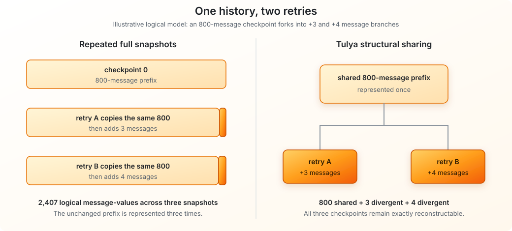
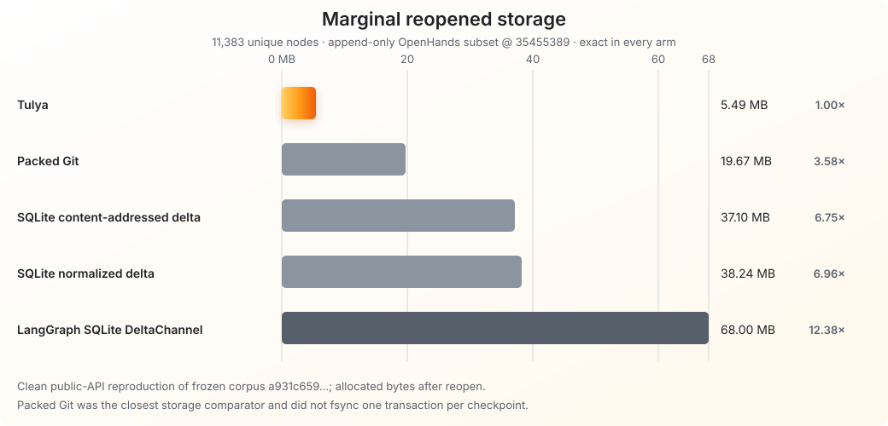
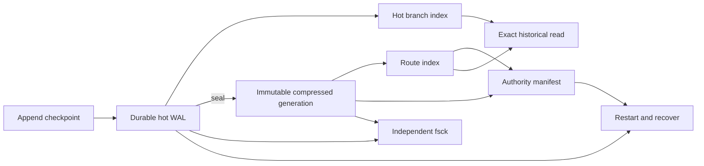

# Tulya Checkpoint Store

**Fork agent history without duplicating its unchanged logical past.**

Long-running agents accumulate history, then retry, branch, and explore from
earlier checkpoints. Full snapshots repeatedly store shared prefixes.
Delta-oriented designs can reduce that duplication, but may trade storage for
reconstruction work and more complex lineage management.

**Tulya structurally shares unchanged history while keeping every checkpoint
exactly reconstructable.** It is an embedded Rust store built first for agent
checkpoint histories and useful anywhere versions fork from long shared
prefixes.

On a pinned public workload of **11,383 agent checkpoints**, Tulya used
**5.49 MB of marginal allocated storage after reopen**. LangGraph SQLite
DeltaChannel used **12.38x more**, and the tested custom SQLite delta stores
used **6.75–6.96x more**. Every arm reconstructed every checkpoint exactly.
[See the evidence and qualifications.](docs/BENCHMARKS.md)

```bash
git clone https://github.com/Vedsaga/tulya-checkpoint-store.git
cd tulya-checkpoint-store
cargo run --locked --example branching_history -- /tmp/tulya-example
cargo run --locked --bin tulya-checkpoint -- --db /tmp/tulya-example fsck
```

> [!WARNING]
> **Alpha / design-partner release.** Tulya is embedded, pre-production, and
> single-writer. Its LangGraph integration currently mirrors one append-only
> message channel beside an authoritative saver; it is not yet a drop-in
> replacement. Process-crash recovery is tested, but sudden-power-loss safety
> is not yet claimed.

## See the idea



The diagram shows the logical sharing model, not literal byte accounting.
Tulya uses a persistent structural-sharing representation and verifies the
exact bytes reconstructed for each checkpoint.

## Is Tulya for you?

| Your requirement | Fit today |
| --- | --- |
| Long append-only agent or message histories | **Yes** |
| Retries or forks from historical checkpoints | **Yes** |
| Exact old-state reconstruction | **Yes** |
| Embedded, local, single-writer storage | **Yes** |
| A drop-in LangGraph saver for arbitrary channels | **Not yet** |
| Distributed or multi-writer operation | **Not yet** |
| A sudden-power-loss durability guarantee | **Not yet** |

## Measured result



These numbers come from the clean public-API reproduction on the pinned
OpenHands evaluation corpus. They are a workload-specific storage and
historical-read result—not customer ROI or a universal compression claim.
Packed Git was the closest storage comparator and did not fsync one transaction
per checkpoint; Tulya also used about 1.86x the peak RSS of normalized SQLite.
The corpus digest, exact comparator implementations, losses, and reproduction
commands are in [`docs/BENCHMARKS.md`](docs/BENCHMARKS.md).

## Use it

The core API keeps checkpoint identity and parentage explicit:

```rust
use serde_json::json;
use tulya_checkpoint_store::{CheckpointStore, CheckpointStoreConfig};

let mut store = CheckpointStore::open(
    "./history",
    CheckpointStoreConfig::default(),
)?;

store.append_messages_checkpoint(
    "support-case-42",
    "root",
    0,
    None,
    &[json!({"role": "user", "content": "Investigate the timeout"})],
)?;
store.append_messages_checkpoint(
    "support-case-42",
    "increase-timeout",
    1,
    Some("root"),
    &[json!({"role": "assistant", "content": "Try a longer timeout"})],
)?;
store.append_messages_checkpoint(
    "support-case-42",
    "fix-query",
    1,
    Some("root"),
    &[json!({"role": "assistant", "content": "Optimize the query"})],
)?;

assert_ne!(
    store.read_checkpoint("support-case-42", "increase-timeout")?,
    store.read_checkpoint("support-case-42", "fix-query")?,
);
# Ok::<(), Box<dyn std::error::Error>>(())
```

For LangGraph, `TulyaShadowSaver` leaves the existing saver authoritative and
mirrors branch history fail-open. It covers synchronous and asynchronous graph
execution, restart, branch continuation, sealing, and independent
verification. See the
[`integrations/langgraph` guide](integrations/langgraph/README.md).

## What ships in this alpha

- **Keep branches compactly:** descendants share unchanged history.
- **Read any checkpoint exactly:** no summarization or semantic approximation.
- **Recover acknowledged appends:** restart replays the durable WAL prefix.
- **Verify independently:** read-only `fsck` checks every retained checkpoint.
- **Seal and reclaim:** older history becomes immutable compressed generations.
- **Prune deliberately:** subtree deletion is durable and sibling-safe.
- **Adopt incrementally:** shadow an existing backend before trusting Tulya with
  authoritative reads.
- **Learn one format:** users see one Tulya checkpoint format, not a menu of
  v3/v4/v5 product variants.

## Under the hood



The manifest is the authority boundary. Acknowledged hot writes remain in the
WAL; sealed history moves into immutable compressed generations with route
indexes. Physical lifecycle controls are available under
`tulya_checkpoint_store::admin`.

## Reliability boundary

The deterministic crash suite exits the writer at 16 publication boundaries
across first and later generations—**32 process-crash cases** in total. Every
case must reopen to exactly the old or target authority, preserve sibling
branches, resume idempotently, and reach the target on the next reopen.

This proves behavior at named userspace process-exit boundaries on the tested
Linux/filesystem stack. It does not establish drive-cache, torn-sector,
cross-filesystem, multi-writer, distributed-consensus, or sudden-power-loss
safety. Read [`docs/RECOVERY.md`](docs/RECOVERY.md) and
[`docs/CRASH_TESTING.md`](docs/CRASH_TESTING.md) before using Tulya as an
authoritative store.

## Verify the release

```bash
cargo fmt --all -- --check
cargo clippy --all-targets --locked -- -D warnings
cargo test --all-targets --locked -- --test-threads=1
cargo test --locked --features fault-injection \
  --test crash_matrix -- --test-threads=1
cargo package --locked
```

Build the release CLI before running the LangGraph smoke test:

```bash
cargo build --release --locked --bin tulya-checkpoint
PYTHONPATH=integrations/langgraph python -m unittest -v \
  integrations/langgraph/test_shadow_smoke.py
```

The release smoke benchmark needs no dataset download:

```bash
cargo build --release --locked --bin tulya-checkpoint
python3 benchmarks/release_smoke.py
```

## Documentation

- [Benchmark evidence and reproduction](docs/BENCHMARKS.md)
- [On-disk format and compatibility](docs/FORMAT.md)
- [Durability and recovery](docs/RECOVERY.md)
- [LangGraph verified shadow](integrations/langgraph/README.md)
- [Design-partner evaluation](docs/DESIGN_PARTNER.md)
- [Security policy](SECURITY.md)
- [Contributing](CONTRIBUTING.md)

Tulya is MIT licensed.
